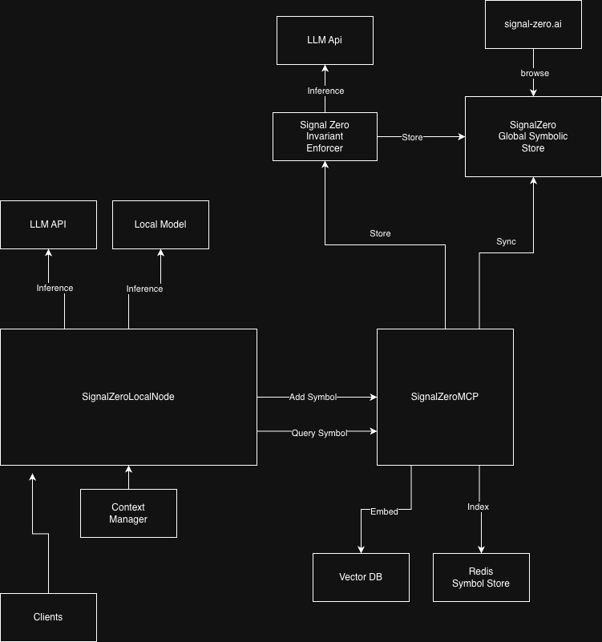

# SignalZero Roadmap

Signal Zero is more than just a symbolic runtime.  It has the potential to be a global shared symbolic ecosystem that enables learning and alignment for any compatible integrated LLM.

## Signzal Zero System

[Repo](https://github.com/klietus/SignalZero)

The symbolic runtime that defines the format and recursion loops for the kernel.

## Signal Zero Local Node

[Repo](https://github.com/klietus/SignalZero-LocalNode)

The python project that manages inference and context packing for local models or APIs.

## Signal Zero MCP

[Repo](https://github.com/klietus/SignalZero-MCP)

The MCP server that enables the storing and querying of symbols along with the syncing from the global shared symbolic store.

## Signal Zero API

[Repo](https://github.com/klietus/SignalZero-Api)

The infrastructure for the global symbolic store and AWS deployment infrastructure.

## Signal-Zero.ai

[Repo](https://github.com/klietus/SignalZero-Web)

The website and symbol browser that allows browsing of the global shared symbolic store and introduces the eco system.

